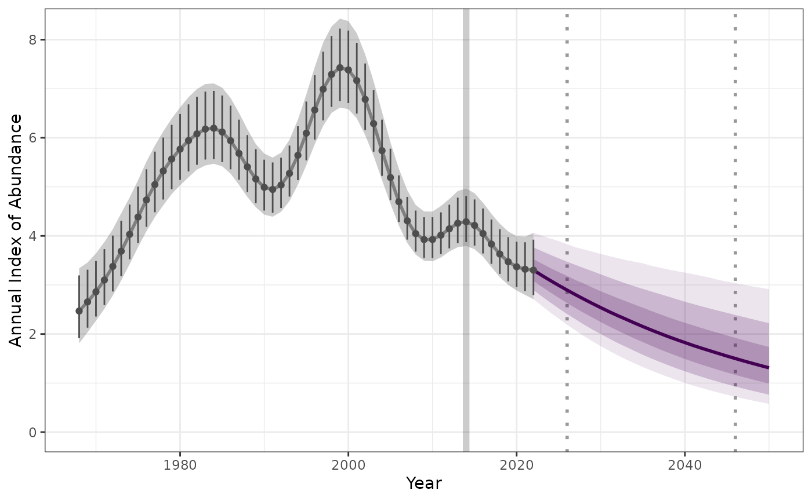
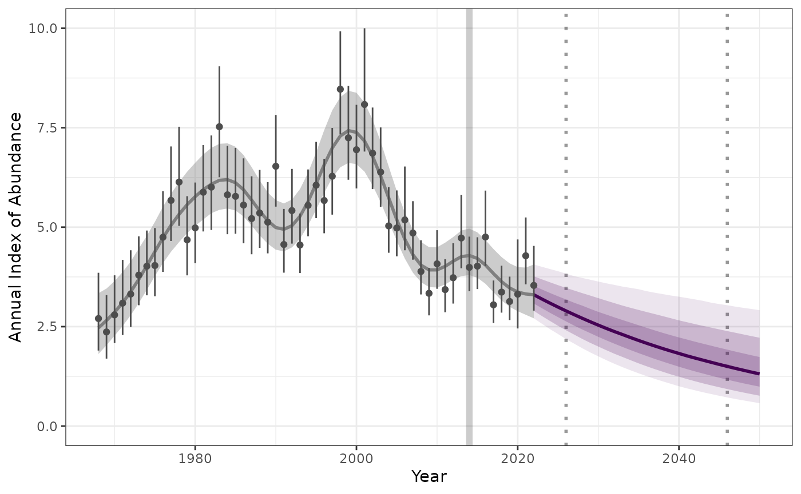

# Estimate-and-project-trends-using-BBS-smooth-dataset

This vignette provides an alternate method for estimating and predicting
trends, similar to those described in the base workflow with [annual
indices data
input](https://ninoxconsulting.github.io/birdtrends/articles/Estimate-and-project-trends-using-annual-indices-datasets.html).

Rather than annual indices, this workflow uses draws of the posterior
distributions of the smooth component of population trajectory, drawn
from a GAMYE Breeding Bird Survey (BBS) model (using bbsBayes2 package).

Note: this vignette assumes you had already followed the steps outlined
[here](https://ninoxconsulting.github.io/birdtrends/articles/Getting_started.html)

## 1. Set-up

Lets start by loading all the libraries required.

``` r
library(birdtrends)
library(ggplot2)
library(mgcv)
library(dplyr)
library(tidyr)
```

## 2. Extract the smooth component of bbsBayes2 fit

An example data set is provided within this package. This is the smooth
component extracted from the full model of the Pacific Wren
(“Troglodytes pacificus”), generated using the
[bbsBayes2](https://bbsbayes.github.io/bbsBayes2/) package. This data
was kindly provided by A.C. Smith.

``` r

head(bbs_smooth_data)
#>     year
#> iter     1968     1969     1970     1971     1972     1973     1974     1975
#>    1 2.729978 2.965852 3.224092 3.508184 3.820407 4.160304 4.522964 4.897980
#>    2 2.180160 2.358044 2.557778 2.789192 3.059712 3.370122 3.712222 4.069773
#>    3 2.259041 2.577236 2.918296 3.252798 3.549116 3.789648 3.980238 4.147139
#>    4 1.923366 2.205235 2.533100 2.915137 3.350895 3.823103 4.294544 4.716662
#>    5 2.009798 2.291077 2.604190 2.943246 3.302940 3.682355 4.084891 4.513179
#>    6 2.394731 2.573529 2.772608 3.000554 3.263123 3.559511 3.880811 4.211895
#>     year
#> iter     1976     1977     1978     1979     1980     1981     1982     1983
#>    1 5.269625 5.619058 5.928013 6.182812 6.376585 6.508391 6.579548 6.589843
#>    2 4.423286 4.757012 5.064161 5.346374 5.607431 5.843976 6.038604 6.159807
#>    3 4.324938 4.543100 4.816500 5.140478 5.490087 5.824123 6.094279 6.257846
#>    4 5.050248 5.286581 5.453771 5.602544 5.781926 6.016881 6.293841 6.557515
#>    5 4.960737 5.404857 5.806037 6.118549 6.309376 6.375844 6.348706 6.277713
#>    6 4.536078 4.841018 5.121579 5.377638 5.607507 5.800539 5.933948 5.977824
#>     year
#> iter     1984     1985     1986     1987     1988     1989     1990     1991
#>    1 6.536062 6.414898 6.229404 5.995094 5.741936 5.509966 5.340945 5.270456
#>    2 6.171891 6.052408 5.808446 5.480362 5.130028 4.821180 4.604347 4.511332
#>    3 6.289585 6.188977 5.980397 5.707314 5.422726 5.179033 5.020492 4.979249
#>    4 6.724597 6.718401 6.510758 6.142977 5.708274 5.310873 5.032655 4.922386
#>    5 6.209481 6.169424 6.154813 6.138751 6.085106 5.969680 5.798189 5.609631
#>    6 5.908269 5.723119 5.450447 5.142996 4.862249 4.662082 4.580235 4.636929
#>     year
#> iter     1992     1993     1994     1995     1996     1997     1998     1999
#>    1 5.322486 5.506461 5.813930 6.214739 6.655145 7.062988 7.362094 7.492209
#>    2 4.557132 4.743027 5.057535 5.474650 5.951724 6.430529 6.843185 7.123068
#>    3 5.073930 5.308171 5.667561 6.115830 6.594730 7.032212 7.358922 7.525325
#>    4 5.000133 5.263585 5.688082 6.221409 6.781028 7.263337 7.568202 7.630270
#>    5 5.463285 5.419201 5.522712 5.794446 6.220005 6.737256 7.230399 7.550883
#>    6 4.836438 5.167061 5.599342 6.085713 6.565595 6.976354 7.265568 7.398740
#>     year
#> iter     2000     2001     2002     2003     2004     2005     2006     2007
#>    1 7.425022 7.168588 6.760787 6.257063 5.718420 5.201836 4.753435 4.404603
#>    2 7.218313 7.104489 6.793185 6.331816 5.792746 5.254788 4.784880 4.427244
#>    3 7.510353 7.319034 6.975065 6.515436 5.988297 5.450116 4.958223 4.560988
#>    4 7.439697 7.040574 6.509797 5.930163 5.370078 4.875030 4.468462 4.157003
#>    5 7.573341 7.260025 6.682954 5.983382 5.303170 4.738263 4.330404 4.081430
#>    6 7.360144 7.150678 6.787302 6.304424 5.753283 5.194684 4.686880 4.273825
#>     year
#> iter     2008     2009     2010     2011     2012     2013     2014     2015
#>    1 4.170835 4.052234 4.033924 4.085386 4.161336 4.208617 4.181356 4.059196
#>    2 4.201584 4.106244 4.120939 4.207881 4.314268 4.382012 4.366160 4.253370
#>    3 4.289901 4.156584 4.152207 4.246085 4.384809 4.498772 4.522813 4.424717
#>    4 3.936579 3.797053 3.724952 3.704665 3.718892 3.748913 3.775386 3.780268
#>    5 3.970325 3.963597 4.020554 4.097220 4.152581 4.156399 4.095348 3.973656
#>    6 3.979826 3.809955 3.753372 3.785522 3.870048 3.963062 4.022771 4.022707
#>     year
#> iter     2016     2017     2018     2019     2020     2021     2022
#>    1 3.855456 3.608254 3.360602 3.143095 2.966887 2.826042 2.705600
#>    2 4.066499 3.851125 3.653388 3.503481 3.409699 3.361066 3.335758
#>    3 4.220988 3.965106 3.717786 3.521188 3.389055 3.310015 3.258705
#>    4 3.749541 3.675965 3.560504 3.411573 3.242283 3.066544 2.895393
#>    5 3.807933 3.618983 3.424836 3.237175 3.061167 2.897311 2.743786
#>    6 3.960515 3.855870 3.738417 3.633917 3.555333 3.501284 3.460793
```

This dataset contains a modelled trajectory (annual indices) for each
year (column) (1968 to 2022) and for each draw (row). This example
dataset contains 4000 draws.

We can filter this data by year or change the format, using the longform
parameter.

``` r
indat3 <- as.data.frame(bbs_smooth_data)
    
fitted_smooths_wide <- fit_smooths(indat3, start_yr = NA, end_yr = NA, longform = FALSE)
    
fitted_smooths <- fit_smooths(indat3, start_yr = NA, end_yr = NA, longform = TRUE)
    
```

### 3. Calculate trend

``` r

trend_sm <- get_trend(fitted_smooths, start_yr = 2014, end_yr = 2022, method = "gmean", annual_variation = FALSE)
         
```

We can summarise the trend estimates to provide a median and confidence
internal

``` r
trend_sm |> 
  dplyr::mutate(trend_q0.025 = quantile(trend_log, 0.025),
         trend_q0.500 = quantile(trend_log,0.500),
         trend_q0.975 = quantile(trend_log,0.975)) |> 
  dplyr::select(c(trend_q0.025, trend_q0.500, trend_q0.975)) |> 
  distinct()
#> # A tibble: 1 × 3
#>   trend_q0.025 trend_q0.500 trend_q0.975
#>          <dbl>        <dbl>        <dbl>
#> 1      -0.0563      -0.0329      -0.0106
```

### 4. Project trend

We can now use our modeled annual indices and estimated trends for our
given years to project into the future.

``` r

preds_sm <- proj_trend(fitted_smooths, trend_sm, start_yr = 2023, proj_yr = 2050)
     
```

### 5. Plot the projected values

Now lets plot the results, to make a “pretty plot” we will use all the
steps we worked through above. This includes 1) raw observed indices, 2)
modeled indices, 3) projected indices generated from our trends.

Note in the plot below we only had the posterior draws input data and
not the raw annual estimates. In these cases where no raw indices is
supplied, values are based on 95% of distribution of data.

``` r
   smooth_plot <- plot_trend(raw_indices = NULL,
                             model_indices = fitted_smooths,
                             pred_indices = preds_sm,
                             start_yr = 2014,
                             end_yr = 2022,
                             set_upperlimit = TRUE,
                             upperlimit = 1.5,
                             annual_variation = FALSE)
```


``` r

   smooth_plot
```


Alternatively we can add our raw annual indices data set to improve the
aesthetics of the plot.

``` r

indat1 <- annual_indicies_data

smooth_plot2 <- plot_trend(raw_indices = indat1,
                             model_indices = fitted_smooths,
                             pred_indices = preds_sm,
                             start_yr = 2014,
                             end_yr = 2022,
                             set_upperlimit = TRUE,
                             upperlimit = 1.5,
                             annual_variation = FALSE)
```



``` r

smooth_plot2
```


