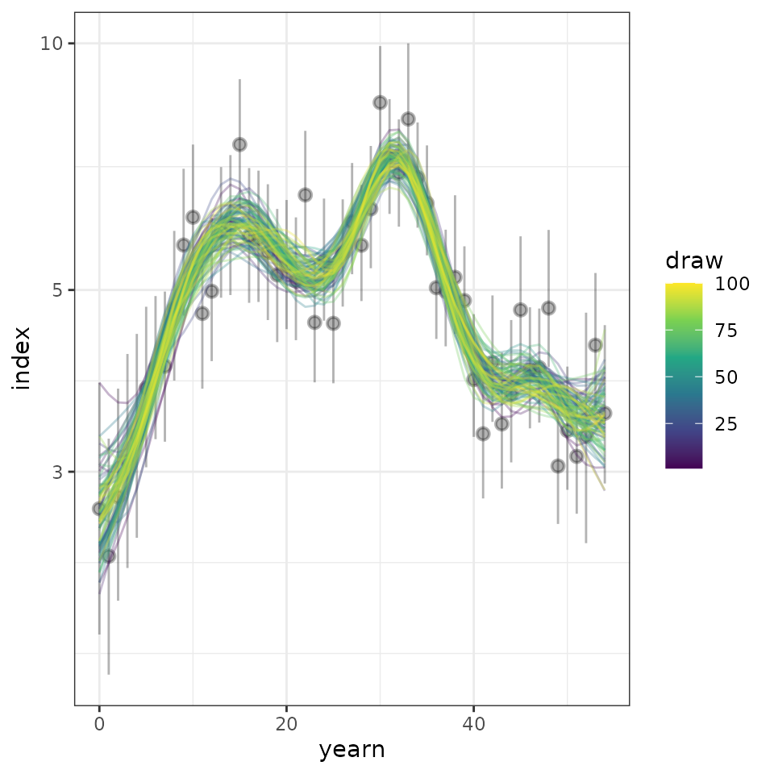
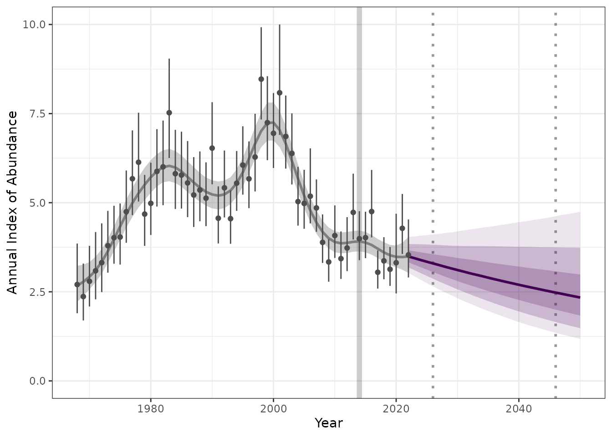
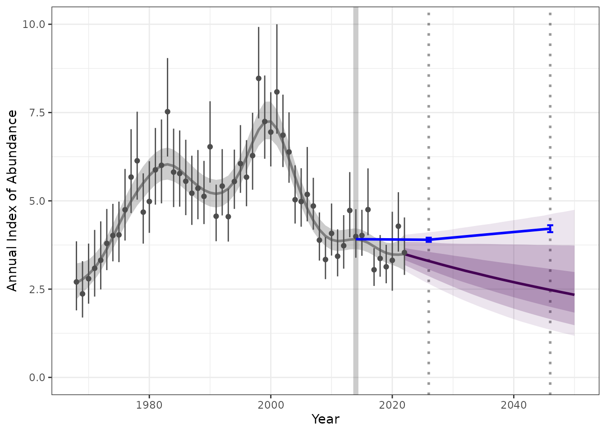

# Estimate and project trends over time

We can use the `birdtrends` package to estimate trends overtime based on
annual indices data. These include information on year of data, index,
and some form of uncertainty.

Note: this vignette assumes you had already followed the steps outlined
[here](https://ninoxconsulting.github.io/birdtrends/articles/Getting_started.html)

### 1. Set-up

Lets start by loading all the libraries required.

``` r
library(birdtrends)
library(ggplot2)
library(mgcv)
library(dplyr)
library(tidyr)
```

### 2. Model the annual indices based on input data of observed annual indices.

In many cases, we may not have access to the breadth of information
retained in estimating the original modeled annual indices.

An example data set is provided within this package. This is an annual
estimate on the Pacific Wren (“Troglodytes pacificus”), generated using
the [bbsBayes2](https://bbsbayes.github.io/bbsBayes2/) package. This
data was kindly provided by A.C. Smith.

``` r

head(annual_indicies_data)
#> # A tibble: 6 × 4
#>    year index index_q_0.025 index_q_0.975
#>   <dbl> <dbl>         <dbl>         <dbl>
#> 1  1968  2.70          1.90          3.85
#> 2  1969  2.37          1.70          3.29
#> 3  1970  2.80          2.09          3.79
#> 4  1971  3.09          2.29          4.18
#> 5  1972  3.32          2.49          4.42
#> 6  1973  3.79          3.04          4.77
```

In this example data set we have an annual index from 1968 to 2022,
along with credible intervals of 2.5% and 97.5%.

#### 2.1 Fit a Bayesian Heirachial GAM (HGAM)

We can fit a hierarchical Bayesian General Additive Model (HGAM) to
estimate the overall trend for the species over all years, or a specific
date range. This model fits a smooth time-series function (i.e., the
GAM) to the log-transformed annual estimates of relative abundance,
while accounting for the uncertainty of each annual estimate (i.e., the
Hierarchical aspect). This is a measurement-error model that assumes
independence in the errors of each annual estimate. This independence
assumption will be false for many sets of estimates (e.g., any estimates
drawn from any model that includes some explicit temporal structure),
but making this independence assumption is reasonable in the absence of
a known autocorrelation structure in the annual errors.

``` r

indat1 <- annual_indicies_data

fitted_data <- fit_hgam(indat1, start_yr = NA, end_yr = NA, n_knots = NA)
#> Running MCMC with 4 parallel chains...
#> 
#> Chain 1 finished in 2.0 seconds.
#> Chain 2 finished in 2.1 seconds.
#> Chain 3 finished in 2.1 seconds.
#> Chain 4 finished in 2.1 seconds.
#> 
#> All 4 chains finished successfully.
#> Mean chain execution time: 2.1 seconds.
#> Total execution time: 2.2 seconds.

# output the same data in a long format for plotting purposes 
fitted_data_wide <- fit_hgam(indat1, start_yr = NA, end_yr = NA, n_knots = NA, longform = FALSE)
#> Running MCMC with 4 parallel chains...
#> 
#> Chain 4 finished in 2.0 seconds.
#> Chain 1 finished in 2.1 seconds.
#> Chain 2 finished in 2.1 seconds.
#> Chain 3 finished in 2.1 seconds.
#> 
#> All 4 chains finished successfully.
#> Mean chain execution time: 2.1 seconds.
#> Total execution time: 2.2 seconds.


## We can also define the start and end time points or number of knots 

# fitted_data <- fit_hgam(indat1, start_yr = 1990, end_yr = 2014, n_knots = NA)
```

#### 2.2 Explore the results

Select a subset of all the fitted HGAM models and reformat to long
format. In this example we selected 100 rows for simplicity.

``` r

sel_hgams <- fitted_data_wide %>%
  dplyr::slice_sample(., n = 100) %>%  
  dplyr::mutate(draw = seq(1, 100, 1)) %>% 
  tidyr::pivot_longer(., cols = !starts_with("d")) |> 
  dplyr::mutate(yearn = as.integer(name) - min(as.integer(name)))
         
```

We can reformat our original data to use in the plot

``` r

min_year <- as.numeric(min(sel_hgams$name))
max_year <- as.numeric(max(sel_hgams$name))

indat1 <- indat1 |> 
  filter(year >= min_year & year <= max_year)%>%
  dplyr::mutate(yearn = as.integer(year) - min(as.integer(year)))  
```

Now we can plot the predicted posterior distributions of 100 draws,
along with the raw annual indices data provided.

``` r
comp_plot <- ggplot2::ggplot(data = sel_hgams,
                    ggplot2::aes(x = yearn,y = value,
                        group = draw, colour = draw))+
  ggplot2::geom_pointrange(data = indat1,
                  ggplot2::aes(x = yearn, y = index,
                      ymin = index_q_0.025,
                      ymax = index_q_0.975),
                  inherit.aes = FALSE,
                  alpha = 0.3)+
  ggplot2::geom_line(alpha = 0.3)+
  ggplot2::scale_colour_viridis_c() +
  ggplot2::scale_y_continuous(trans = "log10")+
  ggplot2::theme_bw()
```

``` r
comp_plot
```



### 3. Estimate trends

We can use our modeled values (fitted_data) to estimate a trend over a
given period of time. This can be used to project into the future.

Firstly lets review our data file, we can see each row contains an
estimated indices per year and per posterior draw (n = 4000). The total
lenght of the file is the number of draws x the number of years for
which we have data.

``` r
head(fitted_data)
#> # A tibble: 6 × 3
#>    draw  year proj_y
#>   <int> <int>  <dbl>
#> 1     1  1968   2.59
#> 2     1  1969   2.70
#> 3     1  1970   2.83
#> 4     1  1971   3.03
#> 5     1  1972   3.31
#> 6     1  1973   3.68
```

Now we can estimate a trend based on a given time internal and method of
estimating trends. Where no dates are specified, the minimum and maximum
years will be used. Two methods are available to estimate trends; 1)
Geometric mean and 2) Linear regression.

``` r

trend_sm <- get_trend(fitted_data, start_yr = 2014, end_yr = 2022, method = "gmean", annual_variation = FALSE)
```

``` r
head(trend_sm)
#> # A tibble: 6 × 5
#>    draw trend_log perc_trend trend_start_year trend_end_year
#>   <int>     <dbl>      <dbl>            <dbl>          <dbl>
#> 1     1  -0.0127      -1.26              2014           2022
#> 2     2  -0.00395     -0.394             2014           2022
#> 3     3  -0.0202      -2.00              2014           2022
#> 4     4   0.0148       1.49              2014           2022
#> 5     5  -0.0174      -1.72              2014           2022
#> 6     6  -0.0259      -2.55              2014           2022
```

We can summarise the trend estimates to provide a median and confidence
internal

``` r
trend_sm |> 
  dplyr::mutate(trend_q0.025 = quantile(trend_log, 0.025),
         trend_q0.500 = quantile(trend_log,0.500),
         trend_q0.975 = quantile(trend_log,0.975)) |> 
  dplyr::select(c(trend_q0.025, trend_q0.500, trend_q0.975)) |> 
  distinct()
#> # A tibble: 1 × 3
#>   trend_q0.025 trend_q0.500 trend_q0.975
#>          <dbl>        <dbl>        <dbl>
#> 1      -0.0344      -0.0142      0.00635
```

### 4. Project trend

We can now use our modeled annual indices and estimated trends for our
given years to project into the future.

``` r
preds_sm <- proj_trend(fitted_data, trend_sm, start_yr = 2023, proj_yr = 2050)
```

``` r
head(preds_sm)
#>   draw year trend_end_year    trend_log perc_trend trend_start_year   proj_y
#> 1    1 1968           2022 -0.012690483 -1.2610299             2014 2.591839
#> 2    2 1968           2022 -0.003952173 -0.3944373             2014 2.478706
#> 3    3 1968           2022 -0.020190401 -1.9987940             2014 2.941516
#> 4    4 1968           2022  0.014829082  1.4939579             2014 2.661204
#> 5    5 1968           2022 -0.017373538 -1.7223488             2014 2.728903
#> 6    6 1968           2022 -0.025869325 -2.5537581             2014 2.276695
#>   starting_pred_ind pred_ind
#> 1          3.510857 2.591839
#> 2          3.736737 2.478706
#> 3          3.510549 2.941516
#> 4          4.008660 2.661204
#> 5          3.474444 2.728903
#> 6          3.263173 2.276695
```

### 5. Plot the projected values

Now lets plot the results, to make a “pretty plot” we will use all the
steps we worked through above. This includes 1) raw observed indices, 2)
modeled indices, 3) projected indices generated from our trends.

``` r

hgams_plot <- plot_trend(raw_indices = indat1, 
                          model_indices = fitted_data, 
                          pred_indices = preds_sm,
                          start_yr = 2014, 
                          end_yr = 2022)
```



### Additional targets and trend estimates

We may also want to track how our predictions are tracking in relation
to short term trends. For example species identified under the partners
in flight have short and long term trends.

For example we may identify a population change from a given time step
(i.e. 2014) to a short and long term trend as a percentage change in
population.

For example we may have a short term target of 2024 with a range of -2%
to 1% we can calculate what the annual index targets range will be. This
can be added to our plots to identify the range we need to meet or how
our predictions are tracking.

``` r
index_baseline <- get_targets(model_indices = fitted_data, 
                              ref_year = 2014, 
                              st_year = 2026, 
                              st_lu_target_pc = -2,
                              st_up_target_pc = 1, 
                              lt_year = 2046, 
                              lt_lu_target_pc = 5,
                              lt_up_target_pc = 10)
```

``` r

hgams_plot_target <- plot_trend(raw_indices = indat1, 
                          model_indices = fitted_data, 
                          pred_indices = preds_sm,
                          start_yr = 2014, 
                          end_yr = 2022, 
                          ref_yr = 2014,
                          targets = index_baseline)
```



## Estimate confidence of reaching targets

We can use the output of the trends to estimate uncertainty around
meeting future trends. In the example above we can estimate the
probability that we will meet our short- term or long-term targets.

Our theoretical targets for the above example is short term (decrease of
2% to increase of 1%) and long term target (2046) is (increase between 5
to 10% )
