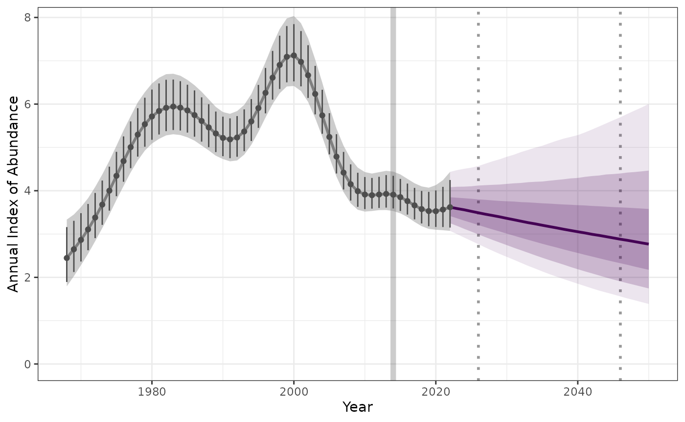

# Estimate-and-project-trends-using-posterior-distribution-draws

This vignette provides an alternate method for estimating and predicting
trends, similar to those described in the base workflow with [annual
indices data
input](https://ninoxconsulting.github.io/birdtrends/articles/Estimate-and-project-trends-using-annual-indices-datasets.html).

Rather than annual indices, this workflow uses draws of the posterior
distributions of the smooth component of population trajectory, drawn
from a GAMYE Breeding Bird Survey (BBS) model (using bbsBayes2 package).

Note: this vignette assumes you had already followed the steps outlined
[here](https://ninoxconsulting.github.io/birdtrends/articles/Getting_started.html)

## 1. Set-up

Lets start by loading all the libraries required.

``` r
library(birdtrends)
library(ggplot2)
library(mgcv)
library(dplyr)
library(tidyr)
```

## 2. Extract the smooth component of bbsBayes2 fit

An example data set, draws of the posterior distribution of annual
indices is provided within this package of the Pacific Wren
(“Troglodytes pacificus”), generated using the
[bbsBayes2](https://bbsbayes.github.io/bbsBayes2/) package. This data
was kindly provided by A.C. Smith. While this dataset was derived using
the bbsBayes model, any Bayesdian trend model output will provide
suitable input.

``` r

head(posterior_draws_data)
#>       1968     1969     1970     1971     1972     1973     1974     1975
#> 1 3.082610 3.015123 3.335139 3.489513 3.998989 3.619001 4.508912 4.264301
#> 2 2.195914 1.689211 2.546438 2.447753 2.762040 3.587828 3.401666 3.499648
#> 3 2.916118 2.926004 2.971770 3.579696 3.940871 3.867168 4.009389 3.655491
#> 4 1.820746 1.737737 2.070640 2.766285 3.131045 4.084060 4.052145 4.393454
#> 5 2.356744 2.349365 2.584446 3.466212 2.953743 3.166799 3.750321 3.728934
#> 6 2.646876 2.168418 3.196975 2.731517 3.482707 4.229086 3.879769 4.131091
#>       1976     1977     1978     1979     1980     1981     1982     1983
#> 1 5.523679 6.477107 5.428108 5.070019 5.697802 6.108185 5.501953 7.615102
#> 2 3.944120 4.987994 7.100491 4.716335 5.250659 5.678874 6.286118 7.503666
#> 3 4.725060 5.643631 5.362977 3.814058 4.555867 5.065963 6.022628 7.630880
#> 4 5.303943 5.844403 6.731438 5.031135 5.325335 6.434128 5.890515 8.319976
#> 5 4.691596 6.391333 6.529072 5.253243 5.370466 5.762340 6.074689 7.690788
#> 6 4.975420 4.983748 5.818747 4.391093 6.065233 6.370119 5.694978 6.405580
#>       1984     1985     1986     1987     1988     1989     1990     1991
#> 1 6.639433 6.003091 6.078570 5.656441 5.677746 5.447478 6.968777 4.539658
#> 2 5.256168 5.794810 5.386139 5.227932 5.588750 5.061077 6.958566 4.470953
#> 3 6.494724 6.363043 5.058897 4.696674 5.452792 4.959325 6.637491 4.231191
#> 4 5.390953 5.163086 6.493480 5.699207 5.351699 5.243212 6.556881 4.726460
#> 5 6.971874 6.452838 5.436969 5.631339 5.335568 5.128908 6.775527 4.713633
#> 6 4.582359 4.919383 5.126643 4.781984 5.503255 5.517258 6.281919 4.550026
#>       1992     1993     1994     1995     1996     1997     1998     1999
#> 1 5.618873 3.994067 5.803611 6.028075 5.844031 6.687735 8.833021 7.131837
#> 2 5.051767 4.109664 4.637254 5.879644 5.372946 5.837089 8.577663 6.594505
#> 3 5.171576 3.972754 5.647608 6.182540 6.328446 6.258666 9.045663 7.774180
#> 4 5.796054 4.605419 5.713425 6.473453 5.568326 6.766745 8.318567 7.352257
#> 5 6.439859 4.625376 5.527326 6.101939 6.042497 5.961249 9.189403 6.880410
#> 6 5.449645 4.413135 5.369394 5.551198 5.129341 6.110091 7.972287 7.356251
#>       2000     2001     2002     2003     2004     2005     2006     2007
#> 1 6.698147 8.112948 6.781053 6.342629 5.114471 4.780090 5.894585 4.826077
#> 2 6.615099 7.017240 6.268967 6.384377 5.077061 4.518664 4.923334 5.219011
#> 3 7.233299 9.932660 6.906731 6.971747 5.142817 4.748727 6.886231 4.866096
#> 4 7.419301 7.266199 7.047002 6.079024 4.837489 4.992385 4.916099 5.142322
#> 5 6.543977 8.871820 6.585936 6.221444 5.067310 4.375974 5.296561 4.770052
#> 6 7.489337 7.089186 6.878845 5.835814 4.956890 5.340337 4.719808 4.568851
#>       2008     2009     2010     2011     2012     2013     2014     2015
#> 1 4.041358 3.311982 3.956497 3.677391 4.133665 4.523377 4.154316 3.790820
#> 2 3.815540 2.858512 4.540620 3.186778 3.015334 5.003184 3.879132 4.193345
#> 3 4.252738 3.321772 4.616294 3.554062 3.549213 4.339809 3.990611 3.759318
#> 4 3.714625 3.256193 3.857840 2.952423 3.489479 4.673957 3.571859 3.572310
#> 5 4.099561 3.896718 4.153645 3.561329 3.402610 4.569009 3.715163 3.555024
#> 6 3.546721 2.805329 3.894595 3.081243 4.037600 4.772590 4.130292 4.412891
#>       2016     2017     2018     2019     2020     2021     2022
#> 1 4.338010 2.802719 3.660448 3.050623 2.767314 4.349836 3.403097
#> 2 4.957471 3.246485 3.143533 2.772658 3.567344 4.593318 3.771982
#> 3 4.886972 3.182487 3.408514 3.436348 3.423210 4.834125 3.417634
#> 4 4.730020 2.905104 3.396004 2.709231 3.076085 3.792921 3.240671
#> 5 4.257917 2.528496 3.035860 3.186154 3.412096 4.005358 3.220321
#> 6 5.149085 3.517740 3.621099 3.273938 2.909139 4.227224 3.385283
```

In this example data set we have draws from the posterior ditribution of
the trend model from 1968 to 2022.

### 2.1 Fit a generalized additive model to each draw (GAM)

We can fit a General Additive Model (GAM) to each draw to estimate the
overall trend for the species over all years, or a specific date range.
This model fits a smooth time-series function (i.e., the GAM) to the
log-transformed annual estimates of relative abundance.

``` r
indat2 <- as.data.frame(posterior_draws_data)
    
fitted_data <- fit_gam(indat2)
    
```

### 3. Calculate trend

``` r

trend_sm <- get_trend(fitted_data, start_yr = 2014, end_yr = 2022, method = "gmean")
         
```

We can summarise the trend estimates to provide a median and confidence
internal

``` r
trend_sm |> 
  dplyr::mutate(trend_q0.025 = quantile(trend_log, 0.025),
         trend_q0.500 = quantile(trend_log,0.500),
         trend_q0.975 = quantile(trend_log,0.975)) |> 
  dplyr::select(c(trend_q0.025, trend_q0.500, trend_q0.975)) |> 
  distinct()
#> # A tibble: 1 × 3
#>   trend_q0.025 trend_q0.500 trend_q0.975
#>          <dbl>        <dbl>        <dbl>
#> 1      -0.0295     -0.00968       0.0119
```

### 4. Project trend

We can now use our modeled annual indices and estimated trends for our
given years to project into the future.

``` r

preds_sm <- proj_trend(fitted_data, trend_sm, start_yr = 2023, proj_yr = 2050)
     
```

### 5. Plot the projected values

Now lets plot the results, to make a “pretty plot” we will use all the
steps we worked through above. This includes 1) raw observed indices, 2)
modeled indices, 3) projected indices generated from our trends.

Note in the plot below we only had the posterior draws input data and
not the raw annual estimates. In these cases where no raw indices is
supplied, values are based on 95% of distribution of data.

``` r
gam_plot <- plot_trend(raw_indices = NULL,
                             model_indices = fitted_data,
                             pred_indices = preds_sm,
                             start_yr = 2014,
                             end_yr = 2022)
```


``` r

gam_plot
```


